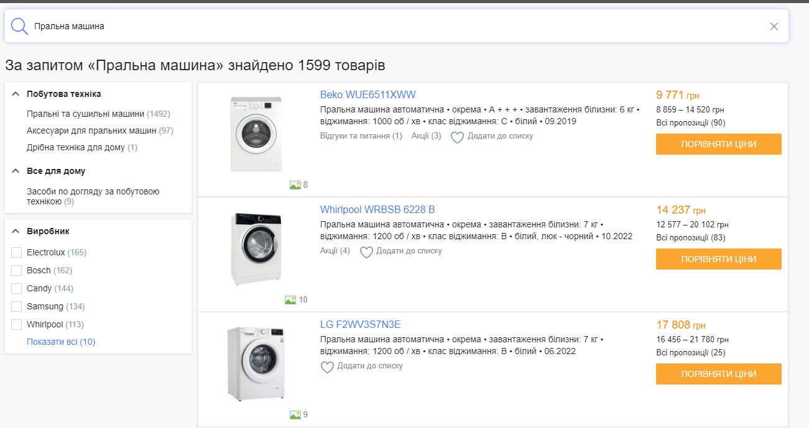
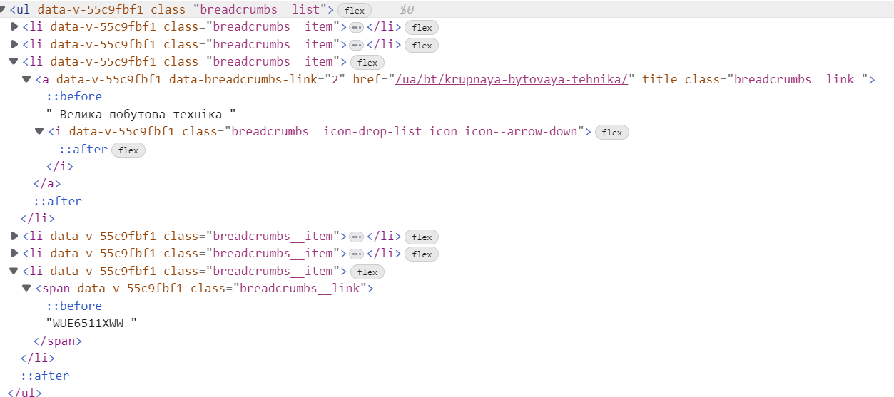

# Лабораторна робота №5

__Обраний варінт: Hotline.ua__

1. ## Список основних функціональних частин сайту:
    - Пошук
    - Каталог товарів
    - Список "Порівняння"
2. ## Тести для функіональних частин
    ### Пошук
    1. #### Введення пошукового запиту
        Ввведення успішне, під час введення система пропонує різні пошукові результати та запити в "реальному часі". 
        
        Після введення можна відправити пошуковий запит натиснувши кнопку "Пошуку"
    2. #### Натискання кнопки "Пошуку"
        Настискання кнопки переводить на сторінку з результатами пошуку
        
    3. #### Натискання кнопки для очищення пошукового запиту
        При натисканні кнопки для очищення пошукового запиту поле для введення пошукового запиту очищується.
        
    4. #### Товар зайдено
        
    5. #### Товар не знайдено
        
    ### Каталог товарів
    1. #### Натискання кнопки "Католог товарів"
        При натисканні кнопки "Каталог товарів" відображається каталог у вигляді меню з оверлейом.
        
    2. #### Наведення на категорію
        При наведені категорію з'являється список з підкатегорії обраної категорії
        
    3. #### Натискання на категорію
        При натискані на категорію відкривається сторінка категорії з повним відображенням підкатегорії 
        
    4. #### Натискання на підкатегорію
        При натискані на категорію відкривається сторінка підкатегорії з відображенням товарів з цієї підкатегорії
        
    5. #### Натискання на "Всі каталоги"
        При натискані пункту "Всі каталоги", що знаходиться в кінці меню каталогу
        
        користувача переводить на сторінку провідника каталогу
        
    ### Список "Порівняння"
    1. #### Додавання товару до порівняння
        Щоб додати товар до порівняння можна зайти на сторінку товару та натиснути кнопку "порівняння", яка досдасть товар до порівняння товарів однієї катеорії/підкатегорії.
        
        ...або ж в списку товарів натиснути на checkbox біля товару.
        Після чого відкриється модальне вікно.
        
    2. #### Натискання кнопки "Закрити" в модельному вікні "товари в порівнянні" при додавання товару до порівняння
        При натискані відповідно до назви закривається модальне вікно
    3. #### Натискання кнопки "порівняти" в модельному вікні "товари в порівнянні" при додавання товару до порівняння
        При натискані на кнопку "порівняти" відривається сторінка з переліком товарів доданих до порівняння
        
    4. #### Натисання кнопки "додати інші товари"
        
        При натисканні кнопки "додати інші товари" користувача переводить на сторінку категорії/підкатегорій в межах який відбувається порівняння.
        
        Тут ми можемо додати інші товари до порівняння
        
        Після чого цей товар буде відображатись в списку на порівняння
    5. #### Натискання кнопки "видалення товару з порівняння"
        
        При натисканні на кнопку "видалення товару з порівняння", котра знаходиться біля зоображення товару товар видалиться з переліку порівяння.
3. ## Створення тестів на основі jest та selenium для двох елементів
    [Файл з тестами](__tests__/third_task.test.js)
4. ## Тестування стандартних компонентів на сайті та порівняння їх роботи з аналогічними стандартними елементами.
    - Кнопка  
        Кнопки мають різні реалізації:
        - Кнопка в w3.org реалізована через тег посилання - a (із сторони семантики це не є правильним рішенням)
        - Кнопка на hotline.ua реалізовано через тег кнопки - button (із сторони семантики це оптимальне рішення)
        Функціональна частина також відрізняється. При наведенні на кнопку реалізовану на w3.org 
    - "Хлібні крихти"  
        Функціональна частина в цього елементу однакового.  
        Реалізація цього елементу відрізнається по структурі:  
        - w3.org
        
        - hotline.ua
        
5. ## Перевірка сайту за допомогою розширення для браузера - "axe DevTools - Web Accessibility Testing"
